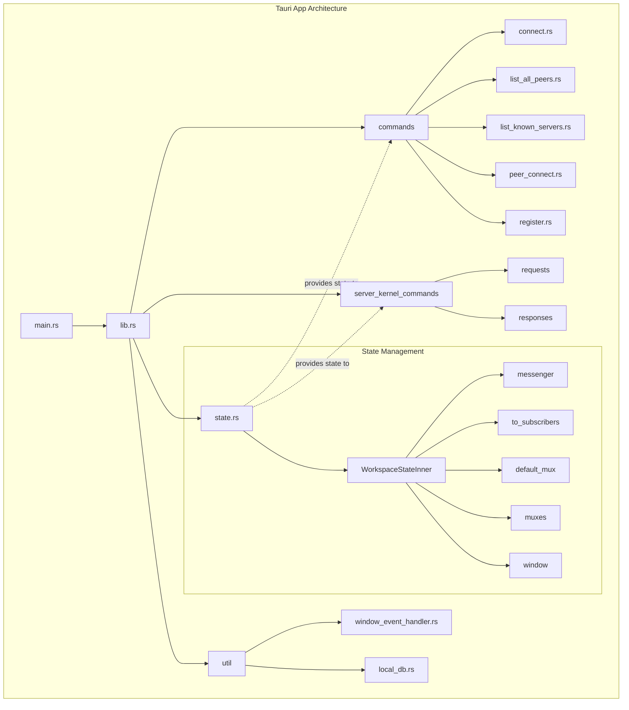
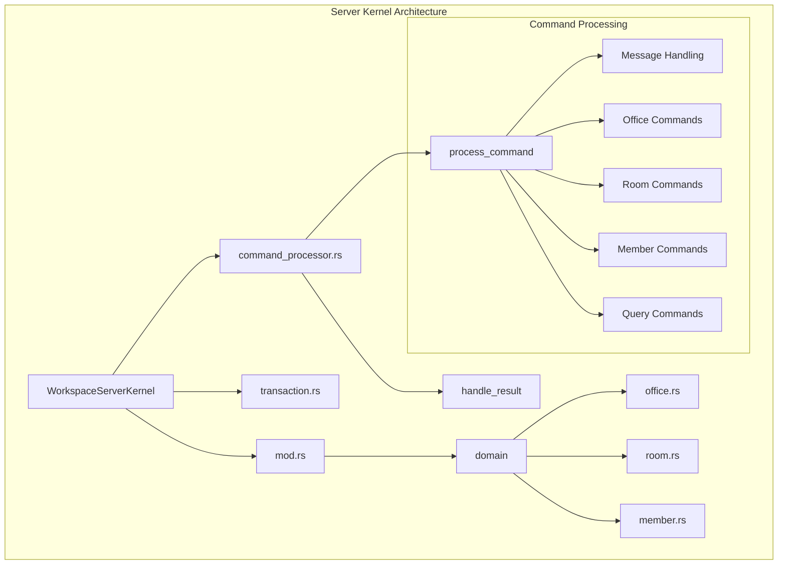
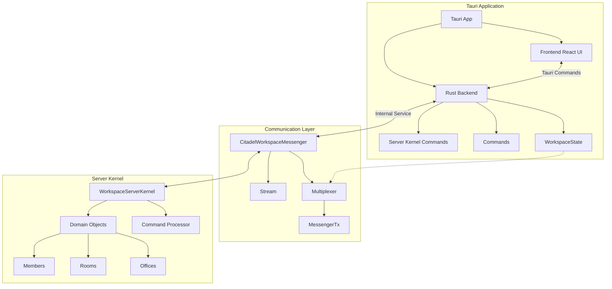
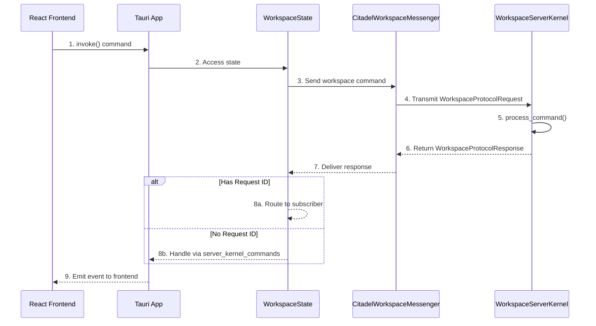
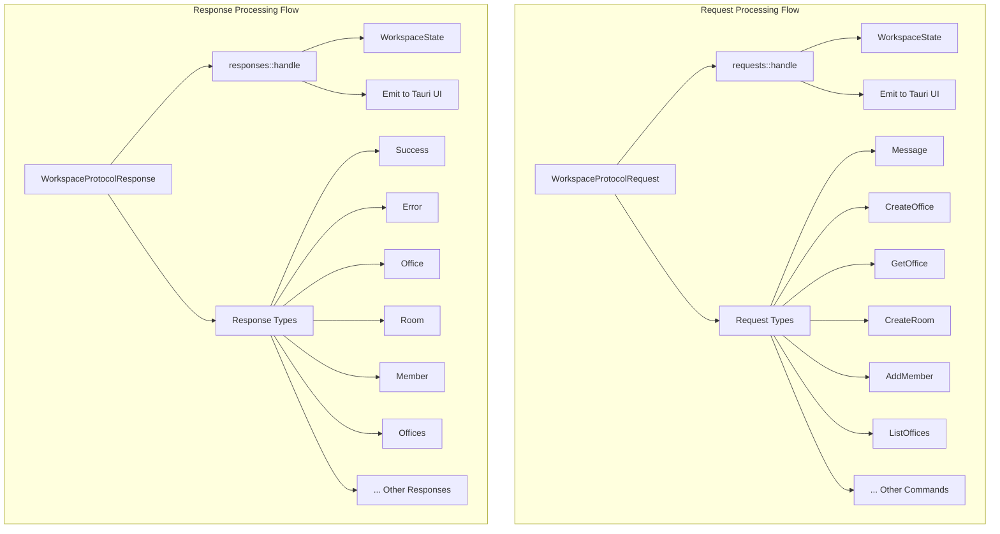

# Citadel Workspace Architecture

This document provides a visual representation of the architecture of the Citadel Workspace application, showing the main components and their interactions.

## Table of Contents

1. [Tauri App Architecture](#tauri-app-architecture)
2. [Server Kernel Architecture](#server-kernel-architecture)
3. [Integration Architecture](#integration-architecture)
4. [Request and Response Flow](#request-and-response-flow)

## Tauri App Architecture

The Tauri app serves as the main interface for users, handling UI interactions and communicating with the server kernel.

## Server Kernel Architecture

The server kernel handles business logic, processing commands, and managing workspace objects.

## Integration Architecture

This diagram shows how the Tauri app and server kernel interact.

## Request and Response Flow

This diagram illustrates how requests and responses flow through the system.

