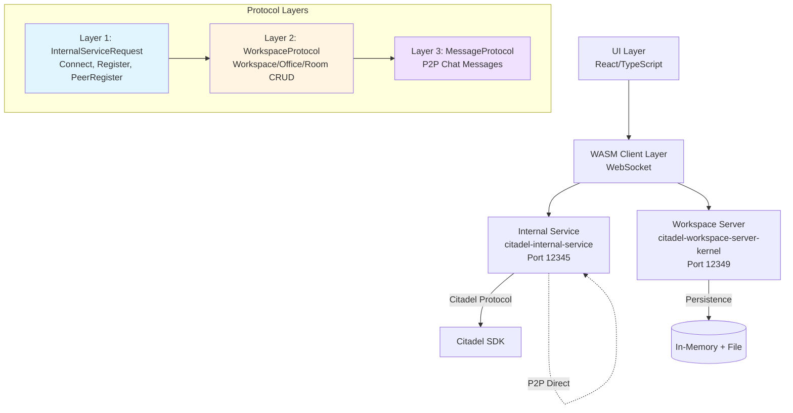

## Programming Principles

**IMPORTANT: Use the `programming-principles` skill when debugging or writing new code.**

The skill provides guidance on:
- **Structure-Driven Development (SDD)** - For complex features with multiple implementations
- **Checkpoint-Based Debugging (CBD)** - For systematic debugging of non-trivial runtime issues
- **Separation of Business logic and I/O (SBIO)** - Critical for minimizing test mocks and maximizing production code test coverage

To invoke: Use the Skill tool with command `programming-principles`.

## Development Notes

- When testing/debugging, keep in mind that this is a tilt project with everything already running. Use tilt logs <service-name>, where service-name can be anything defined in the docker-compose.yml file and/or the Tiltfile: ui, internal-service, server.
- You can use tilt trigger <service-name> to reload a service.
- Be mindful of hot reloading and what services have it enabled.
- When services like internal-service or server are reloaded (since they have in-memory backends for ephemerality to make testing easier), any accounts created on one will be lost on reload.
- Both services will need to reload whenever there are edits to either code base.
- The UI runs locally, and not in the docker container.
- If an error or issue occurs, NEVER skip to the next step or do a workaround. Fix it always.

## Backend/Internal Service Changes - CRITICAL

**⚠️ ALWAYS run the `sync-executor` agent after making ANY backend changes and BEFORE UI testing.**

When you edit code in:
- `citadel-internal-service/` (session management, request handlers, connection logic)
- `citadel-workspace-server-kernel/` (workspace protocol, domain management)
- `citadel-workspace-types/` (type definitions, protocol structures)
- `citadel-workspace-client-ts/` (TypeScript client bindings)
- Any Rust backend crates

**You MUST run the sync-executor agent to:**
1. Rebuild WASM clients (`sync-wasm-client` service)
2. Sync TypeScript bindings (regenerate types)
3. Restart backend services in order: `server` → `internal-service` → `ui`
4. Ensure all changes are propagated through the entire stack

**Sync Executor Workflow:**
```
sync-wasm-client → server → internal-service → ui
```

The agent polls services every 10s, waiting for success indicators like:
- `Running target/debug/citadel-workspace-internal-service --bind '0.0.0.0:12345'`
- `Running target/debug/citadel-workspace-server-kernel --config /usr/src/app/kernel.toml`

Timeout: 5 minutes per service. Errors captured to `./logs/sync-error-[timestamp].log`

**Example workflow:**
```
1. Edit Rust code in citadel-internal-service/src/kernel/requests/connect.rs
2. Run sync-executor agent (DO NOT test UI yet!)
3. Wait for "SUCCESS" confirmation from agent
4. Verify services restarted via logs if needed
5. THEN run UI tests or manual testing
```

**Failure to sync will result in:**
- Stale WASM bindings causing runtime errors
- Type mismatches between backend and frontend
- Session/connection issues
- "Session Already Connected" errors (if session management changes weren't synced)
- Undefined function errors in browser console

## Available Agents

Use these agents to automate complex workflows. Call them via the Task tool with appropriate subagent_type.

| Agent | When to Use | Purpose | Notes |
|-------|-------------|---------|-------|
| **sync-executor** | **IMMEDIATELY after ANY backend code changes** | Rebuilds WASM clients, syncs TypeScript bindings, restarts services | **MANDATORY before UI testing** |
| **create-account** | Testing account creation flow | Creates new account via UI, handles workspace initialization | Username: `testuser{timestamp}`, Password: `test12345` |
| **logout-account** | Testing logout flow | Logs out current account via UI dropdown | Requires active session |
| **login-account** | Testing login flow | Logs in with existing credentials | Use after create-account or logout-account |
| **multi-user-agent** | Testing multi-workspace functionality | Creates 3 accounts, verifies OrphanSessionsNavbar, tests workspace switching | Comprehensive integration test for Slack-like multi-workspace support |
| **workspace-developer** | Complex workspace feature development | Develops/debugs workspace features, works with multi-layered protocol stack | Use for workspace/office/room CRUD, member management |
| **general-purpose** | Complex multi-step research/implementation | Searches codebase, implements features, handles complex tasks | Fallback for tasks not matching specialized agents |
| **Explore** | Codebase exploration and search | Quickly finds files by patterns, searches code for keywords | Use "quick", "medium", or "very thorough" |

## UI Testing with Playwright Agents

The following agents are available for UI testing workflows (defined in `.claude/agents/`):

### create-account Agent
- Creates new accounts via UI using Playwright MCP
- Navigates to http://localhost:5173/ and follows account creation flow
- Handles workspace initialization for first user
- Username format: `testuser{timestamp}`
- Default password: `test12345`

### logout-account Agent
- Logs out current account via UI dropdown menu
- Requires account to be logged in first
- Redirects user to index page after logout

### login-account Agent
- Logs in existing accounts via UI
- Uses credentials from account creation
- Verifies successful workspace loading

### multi-user-agent Agent
- **Purpose:** Comprehensive integration test for multi-workspace functionality (Slack-like)
- **Creates:** 3 test accounts (user1, user2, user3) with timestamped usernames
- **Verifies:**
  - OrphanSessionsNavbar displays all 3 active sessions
  - Workspace initialization (first user only)
  - Subsequent users skip initialization modal
- **Tests:**
  - Workspace switching from landing page to each user
  - Bidirectional switching between all users (6 total switches)
  - ClaimSession protocol functionality
  - MessageNotification routing after session claim
  - Workspace data loading (GetWorkspace, ListOffices)
  - Toast notifications show correct usernames
- **Screenshots:** Takes 13 screenshots at critical verification points
- **Logs:** Checks server and internal-service logs for errors
- **Success Criteria:**
  - All 3 accounts created
  - All workspace switches succeed
  - No "Session Already Connected" errors
  - Workspace data loads without timeouts
- **Use Case:** Run this agent after implementing/fixing multi-workspace features to verify end-to-end functionality

### Testing Account Lifecycle
When testing account operations, use these agents in sequence:
1. `create-account` - Creates and logs in a new user
2. `logout-account` - Logs out the current user
3. `login-account` - Logs back in with existing credentials
4. `multi-user-agent` - Comprehensive multi-workspace integration test

Note: Agents include error checking (`checkForErrors()`) and screen scanning (`scanScreen()`) at critical steps to ensure workflow reliability.

### Multi-Tab Testing (Single Browser)

**IMPORTANT**: The system uses **ONE WebSocket per browser** (not per tab, not per user).

**Testing Multiple Users - Correct Approach:**
```
1. Open Tab 1 → Create/login testuser1
2. Open Tab 2 → Create/login testuser2
3. Both tabs share the same WebSocket connection
4. Both sessions managed by the same internal service connection
5. P2P messaging works between tabs in the same browser
```

**Architecture:**
- **One browser = One WebSocket = One leader tab**
- Leader tab elected via BroadcastChannel/localStorage
- Follower tabs receive updates via broadcast from leader
- All sessions across all tabs coordinated through single WebSocket

**Why This Matters for Testing:**
- ✅ **DO**: Test multiple users in same browser with multiple tabs
- ❌ **DON'T**: Open incognito/separate browsers thinking you need separate connections
- The single-browser, multi-tab approach is the designed testing method
- P2P registration between Tab1↔Tab2 works normally via the shared WebSocket

**Message Flow Example:**
```
Tab 1 (testuser1) sends P2P message
  → Leader tab (if not Tab1, broadcasts to leader)
  → WebSocket → Internal Service
  → Routes to testuser2 session
  → WebSocket → Leader tab
  → Leader broadcasts to all tabs
  → Tab 2 (testuser2) receives message
```

See [ARCHITECTURE.md § Multi-Tab Coordination](./ARCHITECTURE.md#multi-tab-coordination) for detailed implementation.

## WASM Client Development

- When editing the wasm client code in any of the crates, consult ./WASM_SYNC.md and consider using ./sync-wasm-clients.sh to potentially automate the building process.
- Review and understand both the narrative documentation in WASM_SYNC.md and the automation script for comprehensive WASM client development and synchronization workflows.
- Be prepared to manually follow the step-by-step process for building and syncing WASM clients if the automation script does not fully meet your needs.
- **CRITICAL**: After any WASM changes, run the `sync-executor` agent to ensure bindings are updated.

## System Architecture

For comprehensive architecture documentation, see [ARCHITECTURE.md](./ARCHITECTURE.md).

### Quick Architecture Overview



### Protocol Decision Tree

**Use InternalServiceRequest (Direct) for:**
- Authentication: `Connect`, `Register`, `Disconnect`
- P2P Setup: `PeerRegister`, `PeerConnect`, `PeerDisconnect`
- Session Management: `ConnectionManagement` (SetConnectionOrphan, ClaimSession)

**Use WorkspaceProtocol (Inscribed in Message) for:**
- Workspace CRUD: `CreateWorkspace`, `GetWorkspace`, `UpdateWorkspace`
- Office/Room CRUD: `CreateOffice`, `ListOffices`, `CreateRoom`, `ListRooms`
- Member Management: `AddMember`, `UpdateMemberRole`, `ListMembers`

**Use Triple-Nested for P2P Chat:**
```
InternalServiceRequest::Message {
  peer_cid: target_peer,
  message: WorkspaceProtocol::Message {
    contents: MessageProtocol::TextMessage {
      text: "Hello!"
    }
  }
}
```

### Username Propagation in P2P

**IMPORTANT**: Usernames in P2P registration are automatically provided by the Citadel SDK's account manager.

- `PeerRegister` command does **NOT** require a `username` parameter
- Citadel SDK's `PostRegister` event provides `inviter_username` and `invitee_username`
- Internal service passes through as `peer_username` in responses
- **Frontend must read `peer_username` field (NOT `username`)**

**Common Bug**:
```typescript
// ❌ WRONG - Field doesn't exist
const name = message.PeerRegisterNotification.username;  // undefined

// ✅ CORRECT - Read the actual field name
const name = message.PeerRegisterNotification.peer_username;
```

**If you see username errors:**
1. Check TypeScript bindings match Rust struct fields
2. Verify `peer_username` (not `username`) is used in event handlers
3. Regenerate TypeScript bindings if needed

## Protocol Architecture

The Citadel workspace system uses a layered protocol architecture where WorkspaceProtocol is a subprotocol inscribed within InternalServiceRequest messages:

### InternalServiceRequest Layer (Base Transport)
- Handles core connectivity: Connect, Register, Disconnect requests
- P2P operations: openP2PConnection, sendP2PMessage via WASM client
- Message transport: Carries subprotocols via Message variant

### WorkspaceProtocol Layer (Application Subprotocol)
- Inscribed within InternalServiceRequest::Message { peer_cid, message_contents }
- Contains serialized WorkspaceProtocolPayload (Request/Response)
- Operations: Workspace/Office/Room CRUD, Member management
- Server processes WorkspaceProtocolRequests, peers exchange WorkspaceProtocol messages

### P2P Messaging Architecture
P2P messaging uses triple-nested protocols:
1. InternalServiceRequest::Message for P2P transport between peers
2. WorkspaceProtocol::Message inscribed within as serialized payload
3. MessageProtocol (chat subprotocol) serialized in WorkspaceProtocol::Message contents field

### Key Points
- Authentication (Connect/Register/Disconnect) uses direct InternalService requests
- All workspace operations go through WorkspaceProtocol inscribed in InternalService::Message
- P2P messaging requires proper WASM bindings for send_p2p_message
- Domain permissions inherit: Workspace → Office → Room

## Session Management & Resource Cleanup

### Session Lifecycle
Sessions in `citadel-internal-service` are managed in `server_connection_map` (HashMap<u64, Connection>):

**Creation**: `connect.rs` after successful authentication
**Cleanup**: Three pathways:
1. **Explicit disconnect** (`disconnect.rs:24`) - User-initiated logout
2. **TCP connection drop** (`ext.rs:89`) - Browser close/network issue (unless in orphan mode)
3. **Pre-connect cleanup** (`connect.rs:37-55`) - Before new connection for same username

**Orphan Mode**: Sessions persist when TCP drops, allowing reconnection without re-authentication. Managed via `ConnectionManagement` request.

### Resource Cleanup Best Practices
1. **Use RAII**: Connection struct implements Drop for automatic cleanup
2. **Document cleanup**: See `citadel-internal-service/REQUESTS.md` and `RESPONSES.md`
3. **No cleanup in background tasks**: Only clean up in request handlers or protocol event handlers
4. **Check before creating**: Prevent duplicates (e.g., PeerConnect checks if peer already connected)

### Session Management Fixes Implemented
The "Session Already Connected" bug was a **session lifecycle bug**, not a traditional race condition:

**Problem**: Sessions were cleaned up in 3 places:
1. Spawned stream reader task (`connect.rs:139`) - **REMOVED** ✓
2. Explicit disconnect (`disconnect.rs:24`) - Kept
3. TCP drop (`ext.rs:89`) - Kept

**Solution Implemented**:
1. **Removed redundant cleanup** from spawned task (caused race condition)
2. **Added pre-connect cleanup** by username (`connect.rs:37-55`):
   - Searches `server_connection_map` for existing sessions with same username
   - Removes old sessions before creating new one
   - Adds 50ms delay for protocol layer to process cleanup
3. **Added Drop implementation** for Connection struct (`mod.rs:145-182`):
   - RAII pattern ensures cleanup on scope exit
   - Logs cleanup of peers, file handlers, groups
4. **Kept exponential backoff retry** as fallback (100ms, 200ms, 400ms)

**Result**: Sessions are now cleaned up predictably in request handlers only, preventing duplicate session errors.

## Common Debugging Workflows

### Backend Changes Not Reflecting
1. Run `sync-executor` agent
2. Check `tilt logs internal-service` and `tilt logs server` for errors
3. Verify WASM client rebuild completed
4. Check browser console for type errors

### Session/Connection Issues
1. Check `tilt logs internal-service` for "Session Already Connected" or disconnect messages
2. Look for Connection Drop logs with cleanup counts
3. Verify orphan mode status if reconnection is expected
4. Check `server_connection_map` size in GetSessions response

### UI Not Updating
1. Verify backend services are running: `tilt logs server`
2. Check WebSocket connection status in browser DevTools
3. Look for protocol-level errors in `tilt logs internal-service`
4. Verify TypeScript bindings are up-to-date (run `sync-executor`)

### Test Failures After Backend Changes
1. **First**, run `sync-executor` agent
2. Wait for services to fully restart (check logs)
3. Re-run tests
4. If still failing, check for breaking changes in protocol types
- Architecture Insight: The key is to have both tabs open simultaneously with their respective users, rather than switching sessions via
  ClaimSession (which orphans the previous session).
- The internal service IS designed to multiplex multiple sessions over one WebSocket. Add to memory
- Architecture Context:
 - Internal service acts as a smart proxy/multiplexer
 - One WebSocket from frontend → internal service → multiple Citadel protocol connections
 - Multiple sessions (user1, user2, user3) SHOULD share one WebSocket
 - Sessions persist in server_connection_map across reconnections (orphan mode enabled)
- Testing plan for p2p:
     ☐ Create user1 account in Tab 1
     ☐ Create user2 account in Tab 2
     ☐ Create user3 account in Tab 3
     ☐ P2P register user1 ↔ user2
     ☐ P2P register user1 ↔ user3
     ☐ P2P register user2 ↔ user3
     ☐ Test messaging user1 → user2
     ☐ Test messaging user2 → user1
     ☐ Test messaging user1 → user3
     ☐ Test messaging user3 → user1
     ☐ Test messaging user2 → user3
     ☐ Test messaging user3 → user2
     ☐ Document UX issues and errors