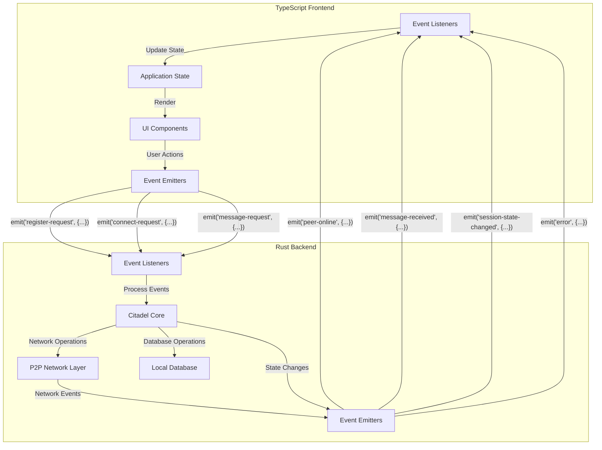
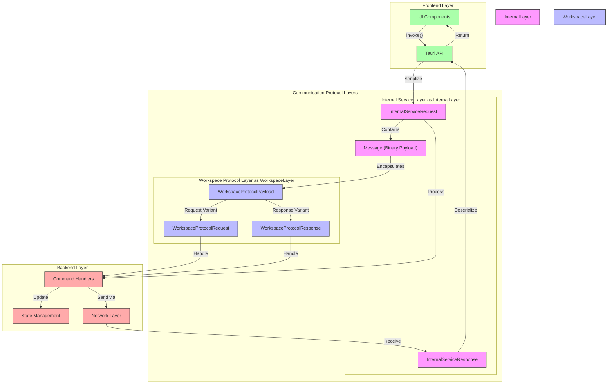
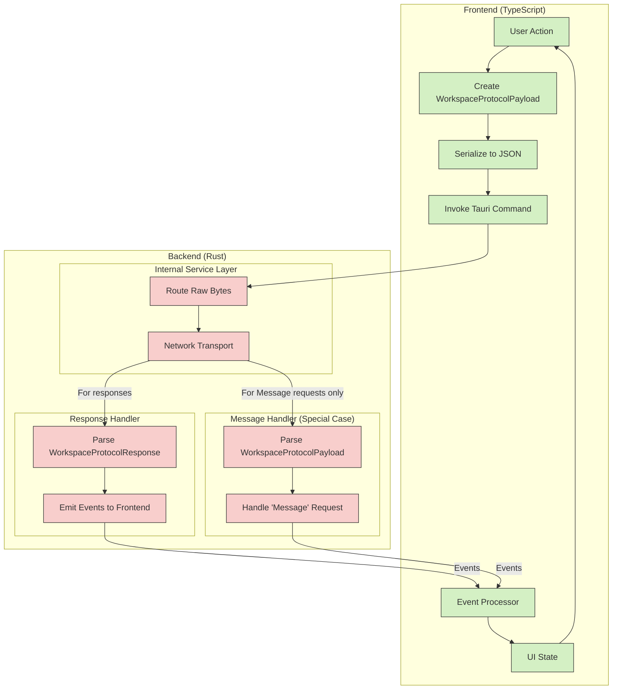

# Event Communication System

## Overview

The Citadel Workspace application implements a bidirectional event communication system between the TypeScript frontend and the Rust backend using Tauri's event API. This system operates alongside the command invocation system, providing real-time notifications, status updates, and asynchronous messaging capabilities.

## Architecture Diagram



## Communication Flow

### 1. Frontend to Backend Events

The TypeScript frontend emits events to the Rust backend in the following scenarios:

- **User-Initiated Actions**: When a user performs an action that requires backend processing (e.g., connecting to a peer, sending a message)
- **UI State Synchronization**: To synchronize UI state with the backend (e.g., marking messages as read)
- **Configuration Changes**: When user preferences or settings are updated

#### Example: Sending a Message Event

```typescript
// TypeScript Frontend
import { emit } from '@tauri-apps/api/event';

async function sendMessageToUser(recipientCid: string, message: Uint8Array) {
  await emit('message-request', {
    cid: currentUserCid,
    peerCid: recipientCid,
    message: message
  });
}
```

```rust
// Rust Backend
fn setup_event_listeners(app: &mut tauri::App) -> Result<(), Box<dyn Error>> {
    app.listen("message-request", move |event| {
        if let Some(payload) = event.payload() {
            let request: Result<MessageRequestTS, _> = serde_json::from_str(payload);
            
            if let Ok(message_request) = request {
                // Process the message request
                // ...
                
                // Send confirmation back to frontend
                event.window().emit("message-sent", MessageSendSuccessTS {
                    cid: message_request.cid,
                    peer_cid: Some(message_request.peer_cid),
                    request_id: None,
                }).unwrap();
            }
        }
    });
    
    Ok(())
}
```

### 2. Backend to Frontend Events

The Rust backend emits events to the TypeScript frontend in these scenarios:

- **Asynchronous Operation Completion**: When long-running operations complete
- **Real-Time Notifications**: For incoming messages, connection requests, etc.
- **State Updates**: When backend state changes that should be reflected in the UI
- **Error Notifications**: When errors occur that the user should be aware of

#### Example: Receiving a Message Notification

```rust
// Rust Backend
fn handle_incoming_message(message: IncomingMessage, window: &tauri::Window) -> Result<(), Box<dyn Error>> {
    // Process the incoming message
    // ...
    
    // Notify the frontend
    window.emit("message-received", MessageNotificationTS {
        message: message.content.to_vec(),
        cid: message.recipient_cid.to_string(),
        peer_cid: message.sender_cid.to_string(),
        request_id: None,
    })?;
    
    Ok(())
}
```

```typescript
// TypeScript Frontend
import { listen } from '@tauri-apps/api/event';

async function setupMessageListener() {
  const unlisten = await listen('message-received', (event) => {
    const notification = event.payload as MessageNotificationTS;
    
    // Update UI with the new message
    addMessageToChat(notification.peer_cid, notification.message);
    
    // Show notification if app is in background
    if (isAppInBackground) {
      showNotification({
        title: 'New Message',
        body: `You have a new message from ${getPeerName(notification.peer_cid)}`
      });
    }
  });
  
  // Store unlisten function to clean up when needed
  return unlisten;
}
```

### 3. Event Types

The Citadel Workspace implements the following event types:

#### Frontend-Emitted Events

- `register-request`: Request to register with a server
- `connect-request`: Request to connect to a server
- `disconnect-request`: Request to disconnect from a server
- `peer-connect-request`: Request to connect to a peer
- `peer-disconnect-request`: Request to disconnect from a peer
- `message-request`: Request to send a message
- `local-db-set-kv-request`: Request to set a key-value pair in the local database
- `local-db-get-kv-request`: Request to get a key-value pair from the local database

#### Backend-Emitted Events

- `peer-online`: Notification that a peer has come online
- `peer-offline`: Notification that a peer has gone offline
- `message-received`: Notification of a received message
- `session-state-changed`: Notification that the session state has changed
- `error`: Notification of an error
- `connection-status-changed`: Notification that the connection status has changed
- `registration-success`: Notification of successful registration
- `registration-failure`: Notification of failed registration

## Protocol Layers

The Citadel Workspace application implements a layered communication protocol architecture to provide flexibility, extensibility, and clear separation of concerns:



### Layer 1: Internal Service Layer

The base communication layer consists of `InternalServiceRequest` and `InternalServiceResponse` types, which handle the fundamental message passing between the TypeScript frontend and the Rust backend.

Key components:

- **InternalServiceRequest**: Encapsulates a request from the frontend to the backend
- **InternalServiceResponse**: Encapsulates a response from the backend to the frontend
- **Message**: Binary payload within the request/response that can contain arbitrary data

This layer provides a generic communication mechanism without imposing specific structure on the payload content.

```rust
// Sample Internal Service Message flow
pub async fn handle_message(
    packet: InternalServiceRequest,
    state: &WorkspaceState,
) -> Result<InternalServiceResponse, Box<dyn Error>> {
    // Extract the binary message from the request
    let message = packet.message;
    
    // Process the message and generate a response
    // ...
    
    Ok(InternalServiceResponse {
        // Response fields
    })
}
```

### Layer 2: Workspace Protocol Layer

Built on top of the Internal Service Layer, the Workspace Protocol Layer adds structure and semantics specific to workspace operations. It uses the Message field from the Internal Service Layer to transmit its own structured data.

Key components:

- **WorkspaceProtocolPayload**: The main payload type, which can be either a Request or Response
- **WorkspaceProtocolRequest**: Structured request for workspace operations
- **WorkspaceProtocolResponse**: Structured response for workspace operations

This layer implements application-specific logic and operations, providing a higher-level API for workspace functionality.

```typescript
// In TypeScript, the message is wrapped in a WorkspaceProtocolPayload before sending
// The frontend is responsible for creating the proper structure
const workspace_payload = {
  request: {
    message: {
      contents: messageBytes
    }
  }
};

// Serialize the workspace payload
const serializedPayload = JSON.stringify(workspace_payload);
const payloadBytes = stringToUint8Array(serializedPayload);

// Send through the Internal Service Layer
await invoke('send_message', { 
  cid: currentCid,
  peerCid: selectedPeerCid,
  message: payloadBytes
});
```

```rust
// The Rust backend (Internal Service) treats the message as raw bytes
// It does NOT interpret the contents except for specific operations
#[tauri::command]
async fn send_message(cid: String, peer_cid: String, message: Vec<u8>) -> Result<(), String> {
    // The internal service just routes the raw message bytes
    // It doesn't unwrap or interpret WorkspaceProtocolPayload
    let request = InternalServiceRequest {
        cid,
        peer_cid: Some(peer_cid),
        message, // Raw bytes passed through
        // Other fields...
    };
    
    // Send to network layer without interpreting payload content
    send_internal_service_request(request).await
}
```

## Processing Workflow

### Correct Flow of Data



### Important Clarifications:

1. **Frontend Responsibility**: The TypeScript frontend is responsible for creating, serializing, and deserializing the WorkspaceProtocolPayload structures.

2. **Backend's Limited Interpretation**: The Rust backend's Internal Service Layer treats messages as raw bytes and doesn't generally interpret their contents, with two exceptions:
   - When handling 'Message' requests (a special case)
   - When processing responses to emit proper events to the frontend

3. **Data Flow Direction**:
   - Frontend → Backend: TypeScript creates a WorkspaceProtocolPayload, serializes it, and sends it as raw bytes
   - Backend → Frontend: Rust emits events based on response types that the frontend listens for

This design maintains a clean separation between the transport layer (Internal Service) and the application-specific protocols (Workspace Protocol), allowing each to evolve independently.

## Protocol Flow Example

A complete flow through the layered protocol might look like this:

1. **UI Action**:

   ```typescript
   // User initiates a message send in the UI
   sendMessageButton.onClick = () => sendMessage("Hello!");
   ```

2. **Frontend API Call**:

   ```typescript
   // Frontend code calls Tauri invoke function
   async function sendMessage(text: string) {
     const messageBytes = stringToUint8Array(text);
     await invoke('send_message', { 
       cid: currentCid,
       peerCid: selectedPeerCid,
       message: messageBytes
     });
   }
   ```

3. **Internal Service Layer Processing**:

   ```rust
   // Rust backend receives and processes the invoke call
   #[tauri::command]
   async fn send_message(cid: String, peer_cid: String, message: Vec<u8>) -> Result<(), String> {
       // Create an InternalServiceRequest
       let request = InternalServiceRequest {
           cid: cid,
           peer_cid: Some(peer_cid),
           message: message,
           // Other fields...
       };
       
       // Process through internal service
       send_internal_service_request(request).await
   }
   ```

4. **Workspace Protocol Layer Processing**:

   ```typescript
   // In TypeScript, the message is wrapped in a WorkspaceProtocolPayload before sending
   // The frontend is responsible for creating the proper structure
   const workspace_payload = {
     request: {
       message: {
         contents: messageBytes
       }
     }
   };
   
   // Serialize the workspace payload
   const serializedPayload = JSON.stringify(workspace_payload);
   const payloadBytes = stringToUint8Array(serializedPayload);
   
   // Send through the Internal Service Layer
   await invoke('send_message', { 
     cid: currentCid,
     peerCid: selectedPeerCid,
     message: payloadBytes
   });
   ```

   ```rust
   // The Rust backend (Internal Service) treats the message as raw bytes
   // It does NOT interpret the contents except for specific operations
   #[tauri::command]
   async fn send_message(cid: String, peer_cid: String, message: Vec<u8>) -> Result<(), String> {
       // The internal service just routes the raw message bytes
       // It doesn't unwrap or interpret WorkspaceProtocolPayload
       let request = InternalServiceRequest {
           cid,
           peer_cid: Some(peer_cid),
           message, // Raw bytes passed through
           // Other fields...
       };
       
       // Send to network layer without interpreting payload content
       send_internal_service_request(request).await
   }
   ```

5. **Receiving End Processing**:

   ```rust
   // On the receiving end, the message is processed in reverse order
   pub async fn handle_incoming_network_message(bytes: Vec<u8>, state: &WorkspaceState) -> Result<(), Error> {
       // First, deserialize as an InternalServiceResponse
       let internal_response: InternalServiceResponse = serde_json::from_slice(&bytes)?;
       
       // Then extract and process the workspace protocol payload
       let workspace_payload: WorkspaceProtocolPayload = serde_json::from_slice(&internal_response.message)?;
       
       // Handle based on payload type
       match workspace_payload {
           WorkspaceProtocolPayload::Request(request) => {
               // Process the request...
           },
           WorkspaceProtocolPayload::Response(response) => {
               // Process the response...
           }
       }
   }
   ```

## Benefits of the Layered Approach

This layered protocol approach provides several benefits:

1. **Abstraction**: Each layer can be modified independently without affecting others
2. **Reusability**: The base layer can be used for different application-specific protocols
3. **Extensibility**: New protocol types can be added to the workspace layer without changing the base layer
4. **Separation of Concerns**: Clear distinction between transport logic and application logic
5. **Testability**: Each layer can be tested in isolation

## Error Handling

The event system implements robust error handling to ensure reliability:

1. **Frontend Error Handling**: The frontend catches and processes errors from the backend, displaying appropriate messages to users and potentially attempting recovery.

2. **Backend Error Handling**: The backend catches errors during event processing and emits error events to the frontend with descriptive information.

3. **Connection Loss Handling**: Both sides handle temporary connection loss, with automatic reconnection attempts and state synchronization on reconnection.

```typescript
// TypeScript Frontend - Error Handling
listen('error', (event) => {
  const error = event.payload as ErrorNotificationTS;
  
  // Log the error
  console.error(`Error ${error.code}: ${error.message}`);
  
  // Display to user based on severity
  if (error.severity === 'critical') {
    showErrorDialog(error.message);
  } else {
    showToast(error.message, 'error');
  }
  
  // Attempt recovery for specific error types
  if (error.code === 'CONNECTION_LOST') {
    attemptReconnection();
  }
});
```

## Security Considerations

The event communication system implements several security measures:

1. **Input Validation**: All event payloads are validated on both sides before processing.

2. **Type Safety**: Strong typing is used throughout to ensure data integrity.

3. **Authentication**: Events that modify state require authentication.

4. **Rate Limiting**: Backend implements rate limiting to prevent event flooding.

## Best Practices

When extending the event communication system:

1. **Event Naming**: Use consistent naming patterns (e.g., noun-verb for requests, past-tense for notifications).

2. **Type Definitions**: Always define TypeScript interfaces for event payloads.

3. **Error Events**: Include detailed information in error events to aid debugging.

4. **Resource Cleanup**: Always clean up event listeners when components unmount.

5. **Idempotency**: Design events to be idempotent where possible.

## Conclusion

The event communication system forms the backbone of real-time interaction in the Citadel Workspace application. By combining Tauri's bidirectional event API with strong typing and careful error handling, the application achieves reliable, type-safe communication between the TypeScript frontend and Rust backend.
