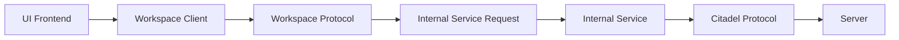
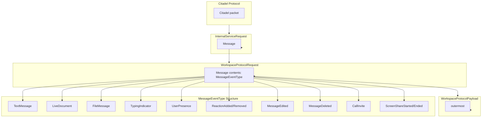

# Citadel Stack Overview

This document describes the multi‑layer architecture of the Citadel project, from the highest‑level UI down to the low‑level Citadel protocol. Each layer “sits above” the layer beneath it, using the lower layer’s services.

| Layer # | Name | Code File(s) | Payload Type | Notes |
|--------|------|--------------|--------------|-------|
| 5 | **UI / Frontend** | `citadel-workspaces/src/pages/*.tsx` (e.g., `Messages.tsx`, `PeerTest.tsx`) | React component props / UI events | Highest level – renders the chat UI, invokes the workspace client, and displays messages. |
| 4 | **Workspace Client (TS Wrapper)** | `citadel-workspace-client-ts/src/WorkspaceClient.ts` | `WorkspaceProtocolPayload` (request | response) | Thin wrapper around the WASM client; exposes high‑level methods (`createWorkspace`, `sendMessage`, …) that internally serialize to `WorkspaceProtocolRequest` / `WorkspaceProtocolResponse`. |
| 3 | **Workspace Protocol** | `citadel-workspace-types/bindings/WorkspaceProtocolRequest.ts`<br>`citadel-workspace-types/bindings/WorkspaceProtocolResponse.ts`<br>`citadel-workspace-types/bindings/WorkspaceProtocolPayload.ts` | `WorkspaceProtocolRequest` / `WorkspaceProtocolResponse` | Triple‑layered protocol (lowest → highest):<br>1️⃣ **InternalServiceRequest/Response** – low‑level commands sent to the internal service.<br>2️⃣ **WorkspaceCommand** – higher‑level workspace operations (create, update, list, etc.).<br>3️⃣ **MessageNotification** – the `Message` variant inside `WorkspaceProtocolRequest` that carries the actual chat payload (implemented as the `MessageNotification` struct). |
| 2 | **Internal Service Request / Response** | `citadel-workspace-client-ts/src/types/InternalServiceRequest.ts` | `InternalServiceRequest` | Enumerates all possible commands the internal service can handle (connect, register, message, file transfer, group ops, etc.). |
| 2.5 | **Intersession Layer Messaging (ILM)** | `citadel-internal-service/intersession-layer-messaging/src/lib.rs` | `Payload<M>` enum & related structs | Uses the **Internal Service Request/Response** layer to provide reliable, ordered messaging, ACK handling, and polling between sessions. **Only used for peer‑to‑peer messaging**. |
| 1 | **Internal Service (Rust)** | `citadel-workspace-internal-service/src/main.rs` (entry point) | Custom binary protocol over the Citadel connection | Manages a per‑client instance of the Citadel protocol, receives messages from the **ILM**, and routes them to the Citadel protocol layer. |
| 0 | **WASM Client (WebSocket Wrapper)** | `citadel-internal-service-wasm-client/src/lib.rs` | WebSocket frames (binary) | Wraps a WebSocket connection to the internal service, providing a low‑level transport for the ILM. |
| -1 | **Citadel Protocol (lowest)** | *Implemented in the Citadel core crates (e.g., `citadel-sdk`, `citadel-internal-service`)* | Binary frames defined by the Citadel spec | Handles reliable, ordered, encrypted transport between peers or between a client and the server. This is the foundation on which all higher layers build. |

### Additional Notes
* **WASM Client** – Implements a WebSocket wrapper (`citadel-internal-service-wasm-client`) that connects to the internal service.
* **ILM (Intersession Layer Messenger)** – Sits **above** the Internal Service Request/Response layer and uses its messages to guarantee ordering, reliability, and ACK handling. It is **only used for peer‑to‑peer messaging**; client‑to‑server communication bypasses the ILM and goes directly from the Workspace Protocol layer to the server.
* **Message Flow (send)**: UI component → `WorkspaceClient` method → `WorkspaceProtocolRequest.Message` → `WorkspaceProtocolPayload` → `InternalServiceRequest.Message` → **ILM** → WASM client (WebSocket) → Internal Service (Rust) → Citadel Protocol → remote peer.
* **Message Flow (receive)**: Citadel Protocol → Internal Service → **ILM** → WASM client (WebSocket) → `InternalServiceResponse` → `WorkspaceProtocolResponse` → `WorkspaceClient` → UI component.

---

## Example Flows

### 1️⃣ Peer‑to‑Peer (P2P) – Register then Send a Message

| Layer # | Name | Code File(s) | Action / Payload |
|--------|------|--------------|------------------|
| 5 | UI / Frontend | `citadel-workspaces/src/pages/PeerTest.tsx` (register button, message input) | User clicks **Register** → UI calls `workspaceClient.auth.register(...)`. After registration, user types a message and clicks **Send** → UI calls `workspaceClient.sendMessage(...)`. |
| 4 | Workspace Client (TS Wrapper) | `citadel-workspace-client-ts/src/WorkspaceClient.ts` | `register` builds an `InternalServiceRequest.Register` and sends it via the WASM client. `sendMessage` builds an `InternalServiceRequest.Message` with the message bytes. |
| 3 | Workspace Protocol | `citadel-workspace-types/bindings/WorkspaceProtocolPayload.ts` | The client serialises the request into a `WorkspaceProtocolPayload` containing a `WorkspaceProtocolRequest` (`Register` or `Message`). |
| 2 | Internal Service Request / Response | `citadel-workspace-client-ts/src/types/InternalServiceRequest.ts` | Payload is an `InternalServiceRequest.Register` or `InternalServiceRequest.Message` variant, carrying fields such as `request_id`, `username`, `message`, `cid`, etc. |
| 2.5 | Intersession Layer Messaging (ILM) | `citadel-internal-service/intersession-layer-messaging/src/lib.rs` | Takes the request, adds reliable‑ordering, ACK handling, and queues it for transport. |
| 0 | WASM Client (WebSocket) | `citadel-internal-service-wasm-client/src/lib.rs` | Sends the framed message over a WebSocket to the remote peer’s internal service. |
| 1 | Internal Service (Rust) | `citadel-workspace-internal-service/src/main.rs` | Receives the WebSocket payload, strips ILM framing, and forwards the low‑level message to the Citadel protocol. |
| -1 | Citadel Protocol | *Citadel core crates* (`citadel-sdk`, `citadel-internal-service`) | Sends encrypted, ordered binary frames over the peer‑to‑peer connection. The remote peer’s internal service receives them. |

**Result:** The remote peer’s UI receives the message via the reverse flow (Layer ‑1 → 1 → 0 → 2.5 → 2 → 3 → 4 → 5) and displays it.


### 2️⃣ Peer/Client → Server (bypassing ILM)

| Layer # | Name | Code File(s) | Action / Payload |
|--------|------|--------------|------------------|
| 5 | UI / Frontend | `citadel-workspaces/src/pages/Connect.tsx` (connect button) | User clicks **Connect** → UI calls `workspaceClient.connect(...)`. |
| 4 | Workspace Client (TS Wrapper) | `citadel-workspace-client-ts/src/WorkspaceClient.ts` | `connect` builds an `InternalServiceRequest.Connect` with server address, credentials, etc., and sends it via the WASM client. |
| 3 | Workspace Protocol | `citadel-workspace-types/bindings/WorkspaceProtocolPayload.ts` | Serialises to a `WorkspaceProtocolPayload` containing a `WorkspaceProtocolRequest.Connect`. |
| 2 | Internal Service Request / Response | `citadel-workspace-client-ts/src/types/InternalServiceRequest.ts` | `InternalServiceRequest.Connect` variant with fields like `username`, `password`, `server_addr`, `connect_mode`, `session_security_settings`, etc. |
| 1 | Internal Service (Rust) | `citadel-workspace-internal-service/src/main.rs` | Directly opens a Citadel connection to the **server** (instead of another peer) and forwards the request. No ILM is involved because the target is a server endpoint. |
| -1 | Citadel Protocol | *Citadel core crates* | Handles the encrypted transport to the server. The server processes the connection request and returns a response (`Connect` success/failure) that travels back up the stack to the UI. |

**Result:** The client is now connected to the server; subsequent workspace commands (e.g., creating a workspace) follow the same stack but target the server rather than a peer.



---

## Payload Types

### InternalServiceRequest
*Defined in:* `citadel-workspace-client-ts/src/types/InternalServiceRequest.ts`

The `InternalServiceRequest` enum represents the low‑level commands that the **Workspace Client** sends to the **Internal Service**. It is the bridge between the TypeScript side and the Rust side.

**Key variants we use:**
| Variant | Payload fields (relevant subset) | Context |
|---------|----------------------------------|---------|
| `Connect` | `request_id`, `username`, `password`, `server_addr`, `connect_mode`, `session_security_settings`, `keep_alive_timeout`, … | **c2s** – client initiates a connection to a Citadel server. |
| `Register` | `request_id`, `server_addr`, `full_name`, `username`, `proposed_password`, `connect_after_register`, … | **c2s** – client registers a new account on a server. |
| `Message` | `request_id`, `message` (byte array), `cid`, `peer_cid`, `security_level` | **p2p** – sending a chat/message payload between peers. Also usable for **c2s** when sending a message to a server, but the server does **not** interpret the inner `MessageNotification` enum. |
| `Disconnect` | `request_id`, `cid` | **c2s** – cleanly close a session. |
| `SendFile`, `DownloadFile`, `GroupMessage`, … | Various file‑transfer and group‑chat fields | Available for extended functionality (not used in the basic examples). |

**Purpose:**  
- Encapsulates all actions the client can request from the internal service.  
- The internal service then translates these into the lower‑level **Citadel Protocol** frames (or routes them via the ILM for peer‑to‑peer messaging).

### WorkspaceProtocolPayload
*Defined in:* `citadel-workspace-types/bindings/WorkspaceProtocolPayload.ts`

`WorkspaceProtocolPayload` is a top‑level enum that wraps either a request or a response for the **Workspace Protocol** layer.

```ts
export type WorkspaceProtocolPayload =
  | { "Request": WorkspaceProtocolRequest }
  | { "Response": WorkspaceProtocolResponse };
```

**Variants:**
| Variant | Contains | Typical use |
|---------|----------|-------------|
| `Request` | `WorkspaceProtocolRequest` | Sent from the client (via the Workspace Client) toward the internal service or remote peer. |
| `Response` | `WorkspaceProtocolResponse` | Sent back from the internal service (or remote peer) to the client, containing results, data, or error information. |

**Purpose:**  
- Provides a uniform envelope for all workspace‑level communication.  
- Allows the client to send a rich set of commands (workspace creation, updates, etc.) and receive structured responses.

### MessageNotification (inner payload of the `Message` variant)
*Defined in:* `citadel-internal-service/citadel-internal-service-types/src/lib.rs` (lines 168‑174). The `MessageNotification` struct is serialized into the `contents: number[]` field of the `Message` variant.

**Purpose:**
- Carries a **semantic message event** serialized as JSON, defined by `message-protocol.ts`.
- Enables rich peer‑to‑peer communication: live document diffs, chat bubbles, presence, reactions, file shares, and more.
- The ILM deserializes this payload to route and handle messages appropriately (ACK, ordering, delivery).

**Structure:**
The `message` field contains a **serialized `MessageEventType`** from `citadel-workspaces/src/types/message-protocol.ts`, which is one of:
- `TextMessage` — plain or markdown text with metadata
- `LiveDocument` — collaborative document diff with `document_id` and `document_title`
- `FileMessage` — file transfer metadata
- `TypingIndicator` — real-time typing state
- `UserPresence` — online/away/busy status
- `ReactionAdded` / `ReactionRemoved` — emoji reactions
- `MessageEdited` / `MessageDeleted` — message lifecycle events
- `CallInvite` / `ScreenShareStarted` — real-time collaboration events

**Example serialized payload (TextMessage):**
```json
{
  "type": "TextMessage",
  "data": {
    "id": "a1b2c3d4-e5f6-7890-1234-567890abcdef",
    "message_type": "text",
    "text": "Hello, world!",
    "timestamp": 1734567890123,
    "replyTo": "b2c3d4e5-f6g7-8901-2345-67890abcdef123",
    "mentions": ["user123"],
    "metadata": {
      "platform": "web"
    }
  }
}
```

**Fields of `MessageNotification`:**
| Field | Type | Description |
|-------|------|-------------|
| `message` | `BytesMut` | Serialized `MessageEventType` (JSON string as UTF-8 bytes) |
| `cid` | `u64` | Connection identifier of the sender |
| `peer_cid` | `u64` | Connection identifier of the receiver |
| `request_id` | `Option<Uuid>` | Optional request identifier for correlation |

*The `MessageNotification` struct is used only for **peer‑to‑peer** messaging via the ILM. The server does not interpret this struct when handling client‑to‑server messages.*

---

**Graph of packet structure (boxes within boxes)**

**Context of use:**
- The `WPRMsg` field contains a **serialized `MessageEventType`** (JSON) from `citadel-workspaces/src/types/message-protocol.ts`.
- This enables rich, structured peer messaging: live document edits, chat bubbles, presence, reactions, file transfers, etc.
- The `MessageNotification` payload is **not raw text** — it is a **semantic message event**.
- The `MessageEventType` structure defines the possible message types that can be serialized into the `message` field of `MessageNotification`.

*Generated by analyzing the source tree and type definitions.*  